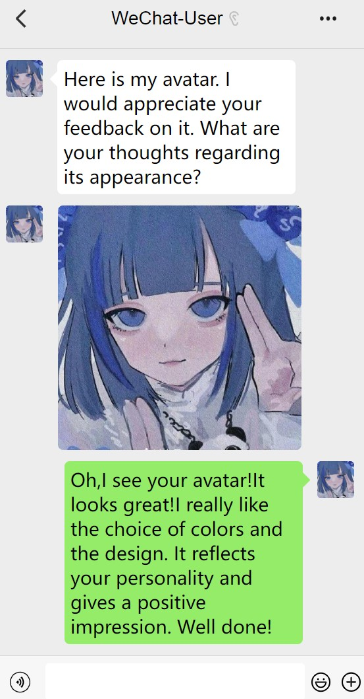

# WeChat conversation Simulator
- This code is designed for simulating WeChat conversations.

# Quick Start

1. Clone the project.
2. Open the file `index.html`.
3. Find the `
` with the class name "chat-box", and you will see some example code.
4. The `
` with the class name "message-left" represents the message sent by the other party, while the class name "message-right" represents the message you have sent.
5. Modify any message content, and you can preview it in the browser.

# Screenshot

